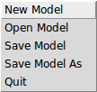

# ROSML Editor GUI
=======================
This codebase controls the graphical editor for *.rosml files.  It allows for the creation, alteration, and deletion of elements within a ROSML model such as 

  1. The workspace
  2. packages
  3. messages
  4. services
  5. component definitions
  6. component timers
  7. component message subscribers
  8. component message publishers
  9. component service providers (servers)
  10. component service users (clients)
  11. nodes
  12. node component instances

Furthermore, the editor allows for the interpretation and analysis of the ROSML model.  Interpretation of the model involves generating component based skeleton code following the design of the model.  Analysis of the model entails either analyzing the model's network quality of service characteristics or analyzing the business logic model's timing and scheduling characteristics.  

## Using the Editor
-------------------
This section describes how to use the ROSML editor to create, open, edit, save, and interpret a ROSML model file.  Most of the user interface for the editor is based around right-click context menus which provide the relevant actions according to the given context.  When the editor is started, the main editor pane does not exist, as no model has been initialized yet.  

The main operations covered in these subsections are

  * [Creating a New Model](#creating-a-model)
  * [Opening an Existing Model](#open-an-existing-model)
  * [Editing a Model](#editing-a-model)
  * [Saving a Model](#saving-a-model)
  * [Generating Code for a Model](#generating-code-for-a-model)

Note: to initialize a model, you must either [Create a new model](#creating-a-model) or [Open an existing model](#open-an-existing-model).

### Creating a Model
--------------------
To create a new model, navigate to the _File_ menu and click on _New Model_.  

Upon doing this, a popup window will appear asking you to name the toplevel workspace for this model.  The workspace is what contains all packages in the model.  

### Opening an Existing Model
-----------------------------
To open an existing model, navigate to the _File_ menu and click on _Open Model_. An open file dialog will popup which will allow you to navigate to the proper folder and file which you want to open.  

### Editing a Model
-------------------

### Saving a Model
------------------
Saving a model in the editor means translating it back into the ROSML file format.  Please note that currently if you have comments in a ROSML model file and choose to overwrite it using the editor, the comments will be lost.  

Saving a model (either through _Save Model_ or _Save Model As_) writes the model to the disk.  If you have created a new model and have not saved it, either option will require you to choose a filename with a dialog.  If you have opened a model or have already saved your new model, then only _Save As_ will prompt you for a filename with a dialog.  

### Generating code for a Model
-------------------------------
To generate the component code based on the model, you simply press the _Interpret_ toolbar button.  This will prompt you for a location in which to generate the code.  The generated code and build system will be placed into a folder created there called _ROS\_Workspace_.  

